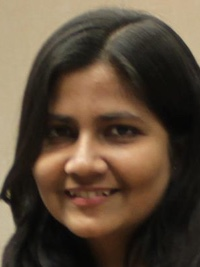
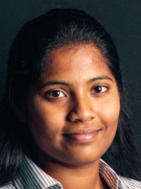
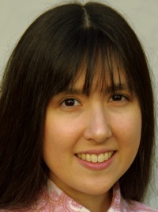
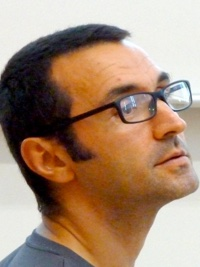

At the HDC Lab, we study how computer science interacts with human
experiences, at all levels. We specialize in novel algorithms for
interactive visualization and exploratory data analysis. This ranges
from creating
[mathematical foundations for the evaluation of visualization designs](http://algebraicvis.net),
to
[novel data structures and systems for interactive data analysis at scale](http://nanocubes.net),
to
[novel ways to characterize data-driven discrimination](http://fairness.haverford.edu).

When human concerns and our modern technological society overlap, we
strive to advance computer science in order to help people lead better lives.

We are part of the
[Department of Computer Science](http://www.cs.arizona.edu) at the
[University of Arizona](http://www.arizona.edu)'s
[College of Science](http://cos.arizona.edu/).

## Members

<table width="98%">
<tr><td width="23%"> <a href="http://www.z-wang.com">Zhe Wang</a> PhD Student</td>
    <td width="2%"></td>
    <td width="23%"> <a href="http://www.cs.arizona.edu/~sabrinanusrat/">Sabrina Nusrat</a> PhD Student</td>
	<td width="2%"></td>
    <td width="23%"> <a href="#">Benafsh Husain</a> PhD Student</td>
    <td width="2%"></td>
	<td width="23%"> <a href="http://aarthysb.com">Aarthy Bhaskar</a> MSc Student</td>
</tr>
<tr><td width="23%"> Youhao Wei MSc Student</td>
    <td width="2%"></td>
	<td width="23%"> <a href="#">Laura Vonessen</a> BSc Student</td>
    <td width="2%"></td>
    <td width="23%"> Sean A. Stephens BSc Student</td>
    <td width="2%"></td>
	<td width="23%"> <a href="http://www.cs.arizona.edu/~nivanferreira">Nivan Ferreira</a> Postdoctoral Scholar</td>
</tr>
</table>
 

<table width="98%">
<tr><td width="23%"> <a href="http://cscheid.net">Carlos Scheidegger</a> Assistant Professor</td>
    <td width="2%"></td>
    <td width="23%"> <a href="#">Kate Isaacs</a> Assistant Professor</td>
    <td width="2%"></td>
    <td width="23%"> <a href="#">Joshua Levine</a> Assistant Professor</td>
    <td width="2%"></td>
    <td width="23%"> <a href="http://www.cs.arizona.edu/~kobourov">Stephen Kobourov</a> Professor</td>
</tr>
</table>
 

## News

* We're excited to share the news that Prof. Joshua Levine and Benafsh
  Husain will be joining the Department of Computer Science and HDC
  Lab in the Fall 2016 semester!

* Congratulations to Laura, who accepted a PhD position at University
  of Washington's Computer Science and Engineering department starting
  in the fall of 2016!

* Congratulations to Youhao and Sean, who
  [won two categories in Hack Arizona 2016](http://hackarizona.org/winners/),
  the biggest hackathon in the Southwest. Together with collaborators
  Ben Gaska and Nick DeJaco, they took both the "Data Science and
  Visualization" and the "Best Transportation Hack" categories!

### Collaborators

* [Mihai Surdeanu](http://www.surdeanu.info/mihai/), Associate Professor

* Bahador Saket, Student Alum, now PhD student at Georgia Tech

* [Jawaherul Alam](http://www.cs.arizona.edu/~mjalam/), PhD

* Lauro Lins, Jim Klosowski, Horace Yip, Gordon Woodhull, Simon Urbanek: AT&T Research
  
* Stephen North, InfoVisible LLC

* [Gautham Narayan](http://ast.noao.edu/about/people/narayan), NOAO

* [Joao Comba](http://www.inf.ufrgs.br/~comba/), Cicero Pahins, UFRGS

### Support and Acknowledgments

Our group is supported partially by the Arizona Board of Regents and
the NSF, under grants
[III-1513651](http://www.nsf.gov/awardsearch/showAward?AWD_ID=1513651)
([project webpage](http://www.sci.utah.edu/~beiwang/networktdav/networktdav.html))
and IIA-1344024.

# Software

We host our software at our [GitHub organization page](http://github.com/hdc-arizona/).
