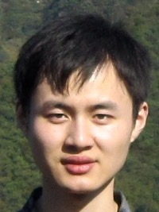
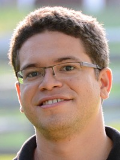
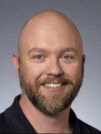

At the HDC Lab, we study how computer science interacts with human
experiences, at all levels. We specialize in novel algorithms for
interactive visualization and exploratory data analysis. This ranges
from creating
[mathematical foundations for the evaluation of visualization designs](http://algebraicvis.net),
to
[novel data structures and systems for interactive data analysis at scale](http://nanocubes.net),
to
[novel ways to characterize data-driven discrimination](http://fairness.haverford.edu).

When human concerns and our modern technological society overlap, we
strive to advance computer science in order to help people lead better lives.

The HDC Lab was founded by [Carlos](http://cscheid.net) when he joined
the department. We are part of the
[Department of Computer Science](http://www.cs.arizona.edu) at the
[University of Arizona](http://www.arizona.edu)'s
[College of Science](http://cos.arizona.edu/).

## Members

<table width="98%">
<tr><td width="23%"> <a href="http://www.z-wang.com">Zhe Wang</a> PhD Student</td>
    <td width="2%"></td>
    <td width="23%"> <a href="#">Sabrina Nusrat</a> PhD Student</td>
	<td width="2%"></td>
    <td width="23%"> Youhao Wei MSc Student</td>
    <td width="2%"></td>
	<td width="23%"> Sean A. Stephens BSc Student</td>
</tr>
<tr><td width="23%"> <a href="#">Laura Vonessen</a> BSc Student</td>
    <td width="2%"></td>
    <td width="23%"> <a href="http://www.cs.arizona.edu/~nivanferreira">Nivan Ferreira</a> Postdoctoral Scholar</td>
    <td width="2%"></td>
    <td width="22%"> <a href="http://cscheid.net">Carlos Scheidegger</a> Assistant Professor</td>
    <td width="2%"></td>
    <td width="23%"> <a href="http://www.cs.arizona.edu/~kobourov">Stephen Kobourov</a> Professor</td>
</tr>
</table>
 

### Collaborators

* [Mihai Surdeanu](http://www.surdeanu.info/mihai/), Associate Professor

* Bahador Saket, Student Alum, now PhD student at Georgia Tech

* Jawaherul Alam, PhD

* Lauro Lins, Jim Klosowski, Horace Yip, Gordon Woodhull, Simon Urbanek: AT&T Research
  
* Stephen North, InfoVisible LLC

# Software

We host our software at our [GitHub organization page](http://github.com/hdc-arizona/).
