## 2020

[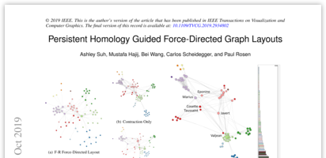](papers/infovis_2019_homologyforce.pdf)
[Ashley Suh](https://www.eecs.tufts.edu/~asuh/), [Mustafa Hajij](http://www.mustafahajij.com/), [Bei Wang](http://www.sci.utah.edu/~beiwang/), [Carlos Scheidegger](https://cscheid.net), [Paul Rosen](http://www.cspaul.com/wordpress/). **Persistent Homology Guided Force-Directed Graph Layouts**. IEEE TVCG, 26(1):697--706, 2020 (Proceedings of IEEE VIS 2019).
[PDF](papers/infovis_2019_homologyforce.pdf)

[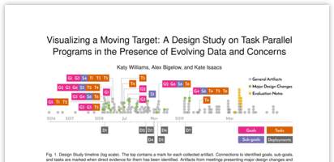](papers/infovis_2019_movingtarget.pdf)
[K. Williams](https://hdc.cs.arizona.edu/people/kawilliams/), [A. Bigelow](https://alex-r-bigelow.github.io/),  and [K. E. Isaacs](https://hdc.cs.arizona.edu/people/kisaacs/). **Visualizing a Moving Target: A Design Study on Task Parallel Programs in the Presence of Evolving Data and Concerns**. To appear in IEEE Transactions on Visualization and Computer Graphics (Proceedings of InfoVis 2019).
[PDF](papers/infovis_2019_movingtarget.pdf)

[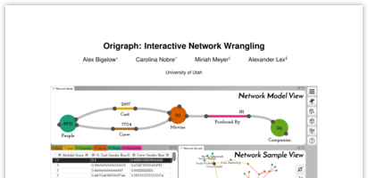](papers/vast_2019_origraph.pdf)
[A. Bigelow](https://alex-r-bigelow.github.io/), C. Nobre, M. Meyer and A. Lex. **Origraph: Interactive Network Wrangling**. To appear at IEEE VAST 2019.
[PDF](papers/vast_2019_origraph.pdf)
[Tool](https://origraph.github.io)
[Video](https://youtu.be/bSFf2iD4TLI)

[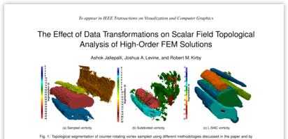](papers/scivis_2019_highorder_topo.pdf)
A. Jallepalli,
[J. A. Levine](http://www.cs.arizona.edu/~josh),
R. M. Kirby.
**The Effect of Data Transformations on Scalar Field Topological Analysis of High-Order FEM Solutions**.
To appear in IEEE Transactions on Visualization and Computer Graphics (Proceedings of SciVis 2019).
[PDF](papers/scivis_2019_highorder_topo.pdf)

## 2019

[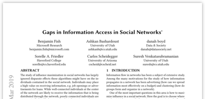](papers/www_2019_informationgaps.pdf)
[Benjamin Fish](http://homepages.math.uic.edu/~bfish3/index.html), Ashkan Bashardoust, danah boyd, [Sorelle Friedler](http://sorelle.friedler.net), [Carlos Scheidegger](https://cscheid.net), [Suresh Venkatasubramanian](http://www.cs.utah.edu/~suresh/). Gaps in Information Access in Social Networks. The World Wide Web Conference (now called [The WebConf](https://www2019.thewebconf.org/)), 480--490, 2019.
[PDF](papers/www_2019_informationgaps.pdf)

[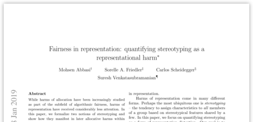](papers/sdm_2019_stereotyping.pdf)
Mohsen Abbasi, [Sorelle Friedler](http://sorelle.friedler.net), [Carlos Scheidegger](https://cscheid.net), [Suresh Venkatasubramanian](http://www.cs.utah.edu/~suresh). Fairness in representation: quantifying stereotyping as a representational harm. Proceedings of the 2019 SIAM International Conference on Data Mining, 801--809, 2019.
[PDF](papers/sdm_2019_stereotyping.pdf)

[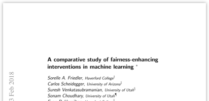](papers/fat_2019_comparative.pdf)
[Sorelle A. Friedler](http://sorelle.friedler.net), [Carlos Scheidegger](https://cscheid.net), [Suresh Venkatasubramanian](https://www.cs.utah.edu/~suresh), Sonam Choudhary, Evan P. Hamilton, Derek Roth. A Comparative Study of Fairness-Enhancing Interventions in Machine Learning. [ACM Conference on Fairness, Accountability, and Transparency](https://fatconference.org/2019/acceptedpapers.html), 2019.
[PDF](papers/fat_2019_comparative.pdf)

[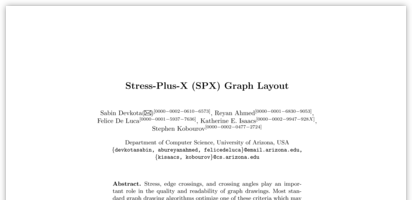](papers/gd_2019_spx_layout.pdf)
[S. Devkota](https://devkotasabin.github.io/), 
[A. R. Ahmed](http://cgi.cs.arizona.edu/~abureyanahmed/profile.html),
[F. De. Luca](https://www.felicedeluca.com/cv),
[K. E. Isaacs](https://hdc.cs.arizona.edu/people/kisaacs/),
and
[S. Kobourov](http://www.cs.arizona.edu/~kobourov).
**Stress-Plus-X (SPX) Graph Layout**.  
Proceedings of 27th International Symposium on Graph Drawing and Network Visualization (GD), 2019.  
[PDF](papers/gd_2019_spx_layout.pdf)

[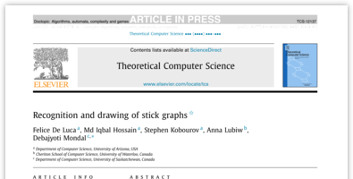](papers/tcs_2019_short_recognition.pdf)
[F. De Luca](https://www.felicedeluca.com/cv),
Md. I. Hossain,
[S. Kobourov](http://www.cs.arizona.edu/~kobourov),
A. Lubiw,
and
D. Mondal.
**Recognition and drawing of stick graphs**.  
Journal on Theoretical Computer Science (TCS), 2019.  
[PDF](papers/tcs_2019_short_recognition.pdf)

[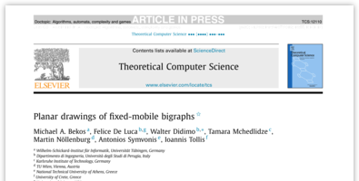](papers/tcs_2019_fm_graphs.pdf)
M. A. Bekos,
[F. De Luca](https://www.felicedeluca.com/cv),
W. Didimo,
T. Mchedlidze,
M. Nöllenburg,
A. Symvonis,
and
I. Tollis.
**Planar drawings of fixed-mobile bigraphs**.  
Journal on Theoretical Computer Science (TCS), 2019.  
[PDF](papers/tcs_2019_fm_graphs.pdf)

[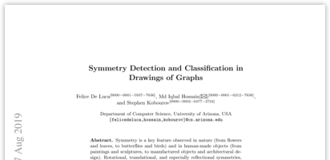](papers/gd_2019_sym_det.pdf)
[F. De Luca](https://www.felicedeluca.com/cv),
Md. I. Hossain,
and
[S. Kobourov](http://www.cs.arizona.edu/~kobourov).
**Symmetry Detection and Classification in Drawings of Graphs**.  
Proceedings of 27th Symposium on Graph Drawing (GD), 2019.  
[PDF](papers/gd_2019_sym_det.pdf)

[K. E. Isaacs](https://hdc.cs.arizona.edu/people/kisaacs/) and T. Gamblin. **Preserving Command Line Workflow for a Package Management System using ASCII DAG Visualization**. IEEE Transactions in Visualization and Computer Graphics, Volume 25, Issue 9, September 2019.
[PDF](papers/tvcg_2018_graphterm_preprint.pdf)

[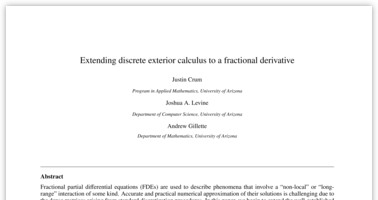](papers/spm_extending_2019.pdf)
J. Crum,
[J. A. Levine](http://www.cs.arizona.edu/~josh), and
A. Gillette.
**Extending discrete exterior calculus to a fractional derivative**.
Computer-Aided Design (Special Issue of Symposium on Solid and Physical Modeling).
[PDF](papers/spm_extending_2019.pdf)

[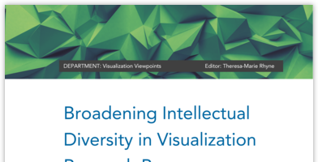](papers/viewpoints_2019_contribution_types.pdf)
B. Lee, [K. E. Isaacs](https://hdc.cs.arizona.edu/people/kisaacs/), D. A. Szafir, G. E. Marai, C. Turkay, M. Tory, S. Carpendale, and A. Endert. **Broadening Intellectual Diversity in Visualization Research Papers**. Computer Graphics & Applications, Visualization Viewpoints, July 2019.
[PDF](papers/tvcg_2018_graphterm_preprint.pdf)

[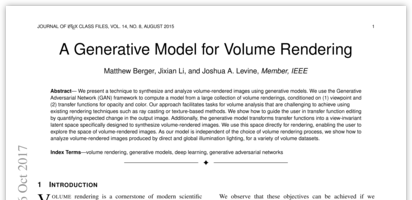](papers/tvcg_generative_2018.pdf)
[M. Berger](https://matthewberger.github.io/),
[J. Li](https://jixianli.github.io/), and
[J. A. Levine](http://www.cs.arizona.edu/~josh).
**A Generative Model for Volume Rendering**.
IEEE TVCG 25(4), April 2019.
[github](https://github.com/matthewberger/tfgan).
[PDF](papers/tvcg_generative_2018.pdf)

[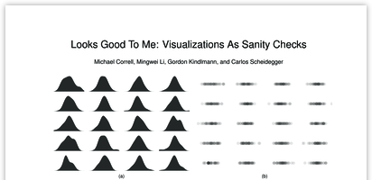](papers/infovis_2018_sanitycheck.pdf)
[M. Correll](https://research.tableau.com/user/michael-correll), [M. Li](http://hdc.cs.arizona.edu/~mwli/), [G. Kindlmann](http://people.cs.uchicago.edu/~glk/), [C. Scheidegger](https://cscheid.net). **Looks Good to Me: Visualizations as Sanity Checks**. To appear in IEEE Transactions in Visualization and Computer Graphics (Proceedings of InfoVis 2018).
[PDF](papers/infovis_2018_dimreader.pdf)

[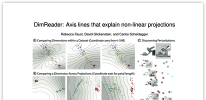](papers/infovis_2018_dimreader.pdf)
[R. Faust](https://rjfaust.github.io), D. Glickenstein, [C. Scheidegger](https://cscheid.net). **DimReader: Axis lines that explain non-linear projections**. To appear in IEEE Transactions in Visualization and Computer Graphics (Proceedings of InfoVis 2018).
[PDF](papers/infovis_2018_sanitycheck.pdf)

## 2018

[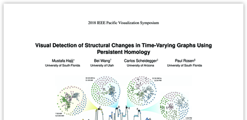](papers/pacificvis_2018_timevaryinghomology.pdf)
[Mustafa Hajij](http://www.mustafahajij.com/), [Bei Wang](http://www.sci.utah.edu/~beiwang/), [Carlos Scheidegger](https://cscheid.net), [Paul Rosen](http://www.cspaul.com/wordpress/). **Visual Detection of Structural Changes in Time-Varying Graphs Using Persistent Homology**. Proceedings of Pacific Vis, 2018. [PDF](papers/pacificvis_2018_timevaryinghomology.pdf)

[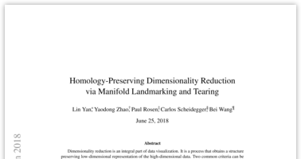](papers/vds_2018_homologymds.pdf)
Lin Yan, Yaodong Zhao, [Paul Rosen](https://www.cspaul.com), [Carlos Scheidegger](/), [Bei Wang](https://www.sci.utah.edu/~cscheid/). Proceedings of [Visual Data Science](http://www.visualdatascience.org/2018/program/), 2018. [PDF](papers/vds_2018_homologymds.pdf)

[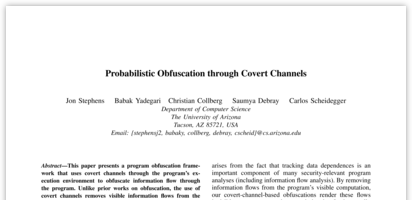](papers/ieeesp_2018_obfuscation.pdf)
Jon Stephens, [Babak Yadegari](https://www2.cs.arizona.edu/~babaky/), [Christian Collberg](http://www.cs.arizona.edu/~collberg), [Saumya Debray](http://www.cs.arizona.edu/~debray), [Carlos Scheidegger](/)
**Probabilistic Obfuscation Through Covert Channels**. Proceedings of IEEE S&P, 2018. [PDF](papers/ieeesp_2018_obfuscation.pdf)

[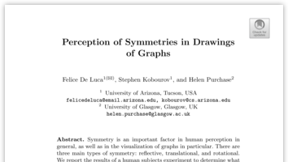](papers/gd_2018_symmetry_perception.pdf)
[F. De Luca](https://www.felicedeluca.com/cv),
[S. Kobourov](http://www.cs.arizona.edu/~kobourov),
and
H. Purchase.
**Perception of Symmetries in Drawings of Graphs**.  
Proceedings of 26th Symposium on Graph Drawing (GD), 2018.  
[PDF](papers/gd_2018_symmetry_perception.pdf)

[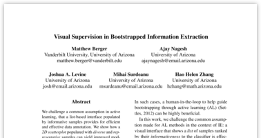](papers/emnlp_2018_visualbootstrap.pdf)
[M. Berger](https://matthewberger.github.io/),
A. Nagesh,
[J. A. Levine](http://www.cs.arizona.edu/~josh),
[M. Surdeanu](http://www.surdeanu.info/mihai/),
[H. Zhang](https://www.math.arizona.edu/~hzhang/).
**Visual Supervision in Bootstrapped Information Extraction**.  
Proceedings of the Conference on Empirical Methods in Natural Language Processing (EMNLP 2018).  
[project](https://matthewberger.github.io/supplemental/visboot.html).
[PDF](papers/emnlp_2018_visualbootstrap.pdf)

[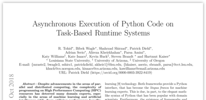](papers/espm2_2018_phylanx.pdf)
R. Tohid, Bibek Wagle, Shahrzad Shirzad, Patrick Diehl, Adrian Serio, Alireza Kheirkhahan, Parsa Amini, [Katy Williams](https://hdc.cs.arizona.edu/people/kawilliams/), [Kate Isaacs](https://hdc.cs.arizona.edu/people/kisaacs/), Kevin Huck, Steven Brandt, and Hartmut Kaiser. **Asynchronous Execution of Python Code on Task-Based Runtime Systems**. Proceedings of the Fourth International IEEE Workshop on Extreme Scale Programming Models and Middleware, November 2018.
[PDF](papers/espm2_2018_phylanx.pdf)

[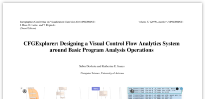](papers/cfg_2018_explorer_preprint.pdf)
[S. Devkota](https://devkotasabin.github.io/) and [K. E. Isaacs](https://hdc.cs.arizona.edu/people/kisaacs/). **CFGExplorer: Designing a Visual Control Flow Analytics System around Basic Program Analysis Operations**. Computer Graphics Forum (Proceedings of EuroVis). July 2018.
[PDF](papers/cfg_2018_explorer_preprint.pdf)

[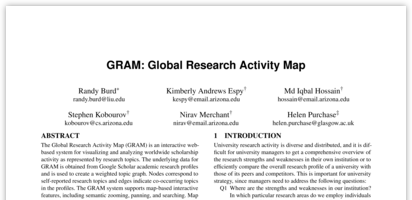](papers/avi_gram_2018.pdf)
R. Burd, K. Espy, I. Hossain, [S. Kobourov](http://www.cs.arizona.edu/~kobourov), N. Merchant, H. Purchase,
**GRAM: Global Research Activity Map**. 12th International Conference on
Advanced Visual Interfaces (AVI), 2018.
[PDF](papers/avi_gram_2018.pdf)

[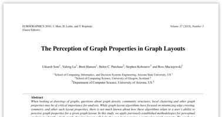](papers/eurovis_ASU_UA_graphs_2018.pdf)
U. Soni, Y. Lu, B. Hansen, H. Purchase, [S. Kobourov](http://www.cs.arizona.edu/~kobourov), R. Maciejewski,
**The Perception of Graph Properties in Graph Layouts**. Computer
Graphics Forum, 2018. (A preliminary version appeared in the 20th IEEE
Eurographics Conference on Visualization (EUROVIS), 2018.)
[PDF](papers/eurovis_ASU_UA_graphs_2018.pdf)

[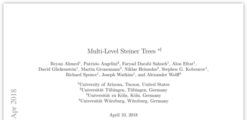](papers/sea_steiner_trees_2018.pdf)
[Reyan Ahmed](http://cgi.cs.arizona.edu/~abureyanahmed/profile.html), Patrizio Angelini, Faryad Darabi Sahneh, Alon Efrat, David Glickenstein, Martin Gronemann, Niklas Heinsohn, [Stephen G. Kobourov](http://www.cs.arizona.edu/~kobourov), Richard Spence, Joseph Watkins, and Alexander Wolff. **Multi-level steiner trees**. [arXiv:1804.02627](https://arxiv.org/abs/1804.02627) (Accepted in 17th International Symposium on Experimental Algorithms (SEA) 2018. )
[PDF](papers/sea_steiner_trees_2018.pdf)

[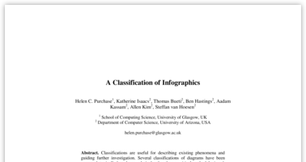](papers/diagrams_infographics_2018.pdf)
Helen Purchase, [Katherine Isaacs](http://hdc.cs.arizona.edu/people/kisaacs/), Thomas Bueti, Ben Hastings, Aadam Kassan, Allen Kim, and Steffan van Hoesen. **A Classification of Infographics**. *Proceedings of the 10th International Conference on the Theory and Application of Diagrams*, June 2018.
[PDF](papers/diagrams_infographics_2018.pdf)

[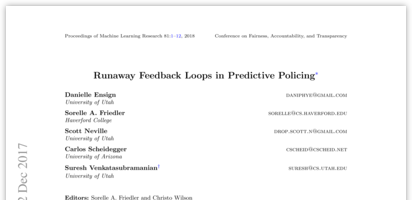](papers/fat_predpol_2018.pdf)
Danielle Ensign, Sorelle A. Friedler, Scott Neville, [Carlos E. Scheidegger](http://cscheid.net/), Suresh Venkatasubramanian. **Runaway Feedback Loops in Predictive Policing**. Published at FAT* 2018.
[PDF](papers/fat_predpol_2018.pdf)

[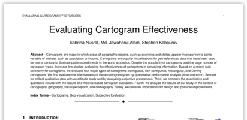](papers/tvcg_eval_cartogram_2018.pdf)
S. Nusrat, J. Alam, [S. Kobourov](http://www.cs.arizona.edu/~kobourov). **Evaluating Cartogram Effectivenesss**. IEEE Transactions on Visualization and Computer Graphics, Volume: 24, Issue: 2, 2018. [PDF](papers/tvcg_eval_cartogram_2018.pdf)

[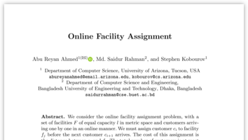](papers/walcom_facility_2018.pdf)
Ahmed A.R., Rahman M.S., [S. Kobourov](http://www.cs.arizona.edu/~kobourov). (2018) **Online Facility Assignment**. In: Rahman M., Sung WK., Uehara R. (eds) WALCOM: Algorithms and Computation. WALCOM 2018. Lecture Notes in Computer Science, vol 10755. Springer, Cham.
[PDF](papers/walcom_facility_2018.pdf)

[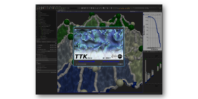](papers/scivis_2017_ttk.pdf)
[J. Tierny](http://www-pequan.lip6.fr/~tierny/),
G. Favelier,
[J. A. Levine](http://www.cs.arizona.edu/~josh),
C. Gueunet, and
M. Michaux.
**The Topology ToolKit**.
IEEE TVCG (Proceedings of SciVis 2017) 24(1), January 2018.
[project](https://topology-tool-kit.github.io/).
[PDF](papers/scivis_2017_ttk.pdf)

## 2017

Michelle Mills Strout, Saumya Debray, [Katherine E. Isaacs](http://hdc.cs.arizona.edu/people/kisaacs), Barbara Kreaseck, Julio Cárdenas-Rodríguez, Bonnie Hurwitz, Kat Volk, Sam Badger, Jesse Bartels, Ian Bertolacci, [Sabin Devkota](https://devkotasabin.github.io/), Anthony Encinas, Ben Gaska, Brandon Neth, Theodore Sackos, Jon Stephens, Sarah Willer, and Babek Yadergari. **Language-Agnostic Optimization and Parallelization for Interpreted Languages**. In *Proceedings of the 30th Workshop on Languages and Compilers for Parallel Computing (LCPC)*, October 2017.
[PDF](papers/lcpc_sci-up-to-par_2017.pdf)

[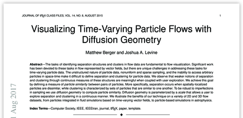](papers/arx_diffusion_geom_2018.pdf)
[M. Berger](https://matthewberger.github.io/) and
[J. A. Levine](http://www.cs.arizona.edu/~josh).
          **Visualizing Time-Varying Particle Flows with Diffusion Geometry**.
[arXiv:1708.03686](https://arxiv.org/abs/1708.03686)
[PDF](papers/arx_diffusion_geom_2018.pdf)

[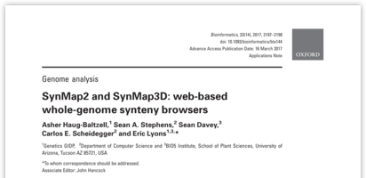](papers/bioinformatics_synmap2_2017.pdf)
Asher Haug-Baltzell, Sean A. Stephens, Sean Davey, [Carlos E. Scheidegger](http://cscheid.net/), Eric Lyons. **SynMap2 and SynMap3D: web-based whole-genome synteny browsers**. Published at Bioinformatics, Volume 33, Issue 14, 15 July 2017.
[PDF](papers/bioinformatics_synmap2_2017.pdf)

[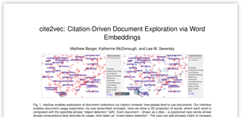](papers/tvcg_cite2vec_2017.pdf)
[Matthew Berger](https://matthewberger.github.io/), Katherine McDonough and Lee M. Seversky. **cite2vec: Citation-Driven Document Exploration via Word Embeddings**. Presented at InfoVis 2016, published at IEEE TVCG 23(1), 691-700.
[PDF](papers/tvcg_cite2vec_2017.pdf)

[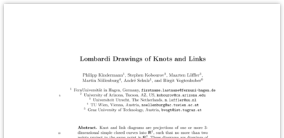](papers/gd_lombardi_2017.pdf)
P. Kindermann, [S. Kobourov](http://www.cs.arizona.edu/~kobourov), M. Loeffler, M. Noellenburg, A. Schulz and
B. Vogtenhuber. **Lombardi Drawings of Knots and Links**. 25th Symposium
on Graph Drawing (GD), 2017.
[PDF](papers/gd_lombardi_2017.pdf)

[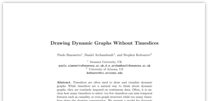](papers/gd_dynamic_2017.pdf)
P. Simonetto, D. Archambault and [S. Kobourov](http://www.cs.arizona.edu/~kobourov). **Drawing Dynamic Graphs
Without Timeslices**. 25th Symposium on Graph Drawing (GD), 2017.
[PDF](papers/gd_dynamic_2017.pdf)

[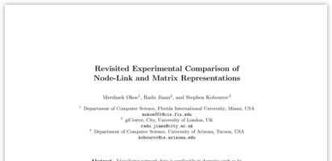](papers/gd_compare_2017.pdf)
M. Okoe, R. Jianu and [S. Kobourov](http://www.cs.arizona.edu/~kobourov). **Revisited Experimental Comparison
of Node-Link and Matrix Representations**. 25th Symposium on Graph
Drawing (GD), 2017. Best paper award.
[PDF](papers/gd_compare_2017.pdf)

[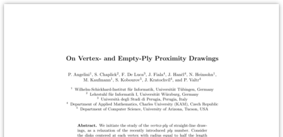](papers/gd_plyproximity_2017.pdf)
P. Angelini, S. Chaplick, F. De Luca, J. Fiala, J. Hancl, N. Heinsohn,
M. Kaufmann, [S. Kobourov](http://www.cs.arizona.edu/~kobourov), J. Kratochvil and P. Valtr. **On Vertex- and
Empty-Ply Proximity Drawings**. 25th Symposium on Graph Drawing (GD),
2017. [PDF](papers/gd_plyproximity_2017.pdf)

[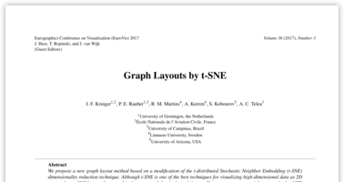](papers/eurovis_tsne_2017.pdf)
H. Kruiger, P. Rauber, R. Martins, A. Kerren, [S. Kobourov](http://www.cs.arizona.edu/~kobourov), and A. Telea. **Graph Layouts by t-SNE**. Computer Graphics Forum, vol. 36, no. 3, 2017. (A preliminary version appeared in the 19th IEEE Eurographics Conference on Visualization (EUROVIS), 2017.) [PDF](papers/eurovis_tsne_2017.pdf)

[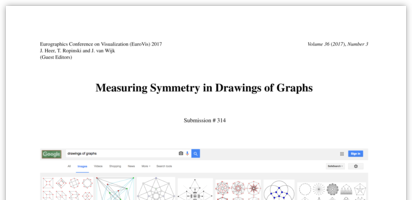](papers/eurovis_symmetries_2017.pdf)
E. Welch and [S. Kobourov](http://www.cs.arizona.edu/~kobourov). **Measuring Symmetry in Drawings of Graphs**. Computer Graphics Forum, vol. 36, no. 3, 2017. (A preliminary version appeared in the 19th IEEE Eurographics Conference on Visualization(EUROVIS), 2017.) [PDF](papers/eurovis_symmetries_2017.pdf)

[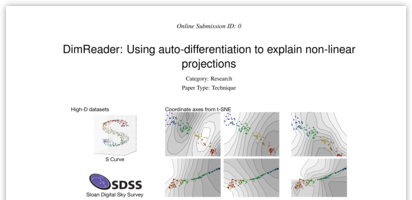](papers/arxiv_2017_dimreader.pdf)
[Rebecca Faust](https://rjfaust.github.io/),
[Carlos Scheidegger](https://cscheid.net). **DimReader: Using
auto-differentiation to explain non-linear
projections**. [arxiv](https://arxiv.org/abs/1710.00992). [PDF](papers/arxiv_2017_dimreader.pdf)

Marianne Procopio, [Carlos Scheidegger](https://cscheid.net),
[Eugene Wu](http://www.cs.columbia.edu/~ewu/), and
[Remco Chang](http://www.cs.tufts.edu/~remco/). **Load-n-Go: Fast
Approximate Join Visualizations That Improve Over Time**. Short paper,
presented at [DSIA 2017](http://www.interactive-analysis.org). [PDF](papers/dsia_2017_load-n-go.pdf)

[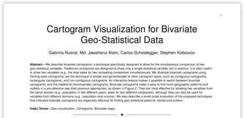](papers/tvcg_2017_bivariate_cartograms.pdf)
Sabrina Nusrat, Md. Jawaherul Alam,
[Carlos Scheidegger](https://cscheid.net),
[Stephen Kobourov](https://www2.cs.arizona.edu/~kobourov/). **Cartogram
Visualization for Bivariate Geo-Statistical Data**. Accepted to IEEE TVCG, to appear. [PDF](papers/tvcg_2017_bivariate_cartograms.pdf)

[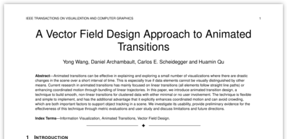](papers/tvcg_2017_transition.pdf)
Yong Wang, Daniel Archambault,
[Carlos Scheidegger](https://cscheid.net), and Huamin Qu. **A Vector
Field Design Approach to Animated Transitions**. Accepted to IEEE TVCG, to appear. [PDF](papers/tvcg_2017_transition.pdf)

## 2016

[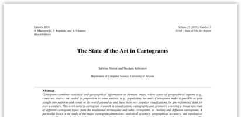](papers/graphics_state_cartograms_2016.pdf)
S. Nusrat and [S. G. Kobourov](http://www.cs.arizona.edu/~kobourov). **The State of the Art in Cartograms**. Computer Graphics Forum, Volume 35 Issue 3, June 2016
Pages 619-642 2016. (A preliminary version appeared in the 18th IEEE
Eurographics Conference on Visualization (EUROVIS), 2017) [PDF](papers/graphics_state_cartograms_2016.pdf)

[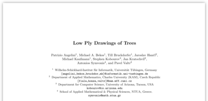](papers/gd_plytrees_2016.pdf)
P. Angelini, M. Bekos, T. Bruckdorfer, J. Hancl, M. Kaufmann, [S.
Kobourov](http://www.cs.arizona.edu/~kobourov), J. Kratochvil, A. Symvonis, and P. Valtr. **Low Ply Drawings
of Trees**. 24th Symposium on Graph Drawing and Network Visualization
(GD), p. 236-248, 2016.
[PDF](papers/gd_plytrees_2016.pdf)

[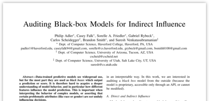](papers/icdm_2016_auditing.pdf)
Philip Adler, Casey Falk,
[Sorelle A. Friedler](http://sorelle.friedler.net), Gabriel Rybeck,
[Carlos Scheidegger](https://cscheid.net), Brandon Smith, and
[Suresh Venkatasubramanian](http://www.cs.utah.edu/~suresh/). **Auditing
Black-Box Models for Indirect Influence**. IEEE ICDM 2016. [PDF](papers/icdm_2016_auditing.pdf)

[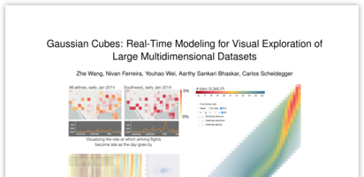](papers/infovis_2016_gaussian.pdf)
[Zhe Wang](http://www.z-wang.com/), Nivan Ferreira, Youhao Wei, Aarthy
Bhaskar, [Carlos Scheidegger](http://cscheid.net). **Gaussian Cubes:
Real-Time Modeling for Visual Exploration of Large Multidimensional
Datasets**. Presented at InfoVis 2016, published at IEEE TVCG
23(1)681-690, 2017. [PDF](papers/infovis_2016_gaussian.pdf)

[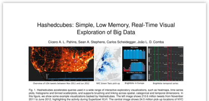](papers/infovis_2016_hashedcubes.pdf)
Cicero Pahins, Sean S. Stephens,
[Carlos Scheidegger](http://cscheid.net),
[Joao Comba](http://www.inf.ufrgs.br/~comba/). **Hashedcubes: Simple,
Low Memory, Real-Time Visual Exploration of Big Data**. Presented at
InfoVis 2016, published at IEEE TVCG 23(1)671-680, 2017.
[PDF](papers/infovis_2016_hashedcubes.pdf)

[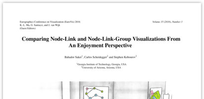](papers/eurovis_2016_comparing.pdf) [Bahador Saket](http://bahadorsaket.com), [Carlos Scheidegger](http://cscheid.net), and [Stephen G. Kobourov](http://www.cs.arizona.edu/~kobourov). **Comparing Node-Link and Node-Link-Group Visualizations From An Enjoyment Perspective**. EuroVis 2016. [PDF](papers/eurovis_2016_comparing.pdf)

## 2015

[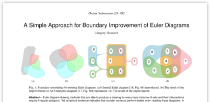](papers/infovis_2015_euler.pdf) Paolo Simonetto, [Daniel Archambault](http://cs.swansea.ac.uk/~csdarchambault/), [Carlos Scheidegger](https://cscheid.net/). **A Simple
Approach for Boundary Improvement of Euler Diagrams**. presented at InfoVis 2015, published at IEEE TVCG 22(1)678--687, 2016. [PDF](papers/infovis_2015_euler.pdf)

 Gordon Woodhull, Simon Urbanek, Stephen North, [Carlos
Scheidegger](http://cscheid.net). **Collaborative Visual Analysis on the Web with
RCloud**. IEEE VAST 2015. [PDF](papers/vast_2015_rcloud.pdf)

 Michael Feldman, [Sorelle Friedler](http://sorelle.friedler.net/), John Moeller, [Carlos Scheidegger](http://cscheid.net),
[Suresh Venkatasubramanian](http://www.cs.utah.edu/~suresh/web/). **Certifying and Removing Disparate
Impact**. ACM KDD 2015. [PDF](papers/kdd_2015_bias.pdf), [arxiv](http://arxiv.org/abs/1412.3756)

 [Bahador Saket](http://bahadorsaket.com), [Carlos Scheidegger](http://cscheid.net), and [Stephen G. Kobourov](http://www.cs.arizona.edu/~kobourov). **Towards
Understanding Enjoyment and Flow in Information Visualization**. EuroVis
2015 (short paper). [PDF](http://cscheid.net/static/papers/eurovis_short_2015.pdf)

 [Bahador Saket](http://bahadorsaket.com), [Carlos Scheidegger](http://cscheid.net), [Stephen G. Kobourov](http://www.cs.arizona.edu/~kobourov), and [Katy
Börner](http://ella.slis.indiana.edu/~katy/). **Map-based Visualizations Increase Recall Accuracy of
Data**. Eurovis 2015.
[PDF](http://cscheid.net/static/papers/eurovis_long_2015.pdf),
[supplemental material](http://cscheid.net/static/papers/eurovis_long_2015_supplemental.pdf),
[data](http://cscheid.net/static/papers/eurovis_long_2015_supplemental.tar.gz)

## 2014

 [Gordon Kindlmann](http://www.cs.uchicago.edu/~glk) and
[Carlos Scheidegger](http://cscheid.net). **An Algebraic Process for
Visualization Design**. TVCG 2014, **honorable
mention for best paper award at InfoVis 2014**. [PDF](papers/infovis_2014_algebraic.pdf)

