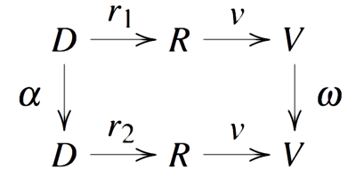

# Publications from the HDC Lab

## 2015

 Paolo Simonetto, Daniel Archambault, Carlos Scheidegger. **A Simple
Approach for Boundary Improvement of Euler Diagrams**. IEEE TVCG,
conditionally accepted. (To be presented at IEEE VIS 2015) [PDF](papers/infovis_2015_euler.pdf)

 Gordon Woodhull, Simon Urbanek, Stephen North, Carlos
Scheidegger. **Collaborative Visual Analysis on the Web with
RCloud**. IEEE VAST 2015, conditionally accepted. [PDF](papers/vast_2015_rcloud.pdf)

 Michael Feldman, Sorelle Friedler, John Moeller, Carlos Scheidegger,
Suresh Venkatasubramanian. **Certifying and Removing Disparate
Impact**. ACM KDD 2015. [PDF](papers/kdd_2015_bias.pdf), [arxiv](http://arxiv.org/abs/1412.3756)

 Bahador Saket, Carlos Scheidegger, and Stephen G. Kobourov. **Towards
Understanding Enjoyment and Flow in Information Visualization**. EuroVis
2015 (short paper). [PDF](http://cscheid.net/static/papers/eurovis_short_2015.pdf)

 Bahador Saket, Carlos Scheidegger, Stephen G. Kobourov, and Katy
Börner. **Map-based Visualizations Increase Recall Accuracy of
Data**. Eurovis
2015. [PDF](http://cscheid.net/static/papers/eurovis_long_2015.pdf),
[supplemental material](http://cscheid.net/static/papers/eurovis_long_2015_supplemental.pdf),
[data](http://cscheid.net/static/papers/eurovis_long_2015_supplemental.tar.gz)

## 2014

 [Gordon Kindlmann](http://www.cs.uchicago.edu/~glk) and
[Carlos Scheidegger](http://cscheid.net). **An Algebraic Process for
Visualization Design**. TVCG 2014, **honorable
mention for best paper award at InfoVis 2014**. [PDF](http://algebraicvis.net/paper.pdf)

